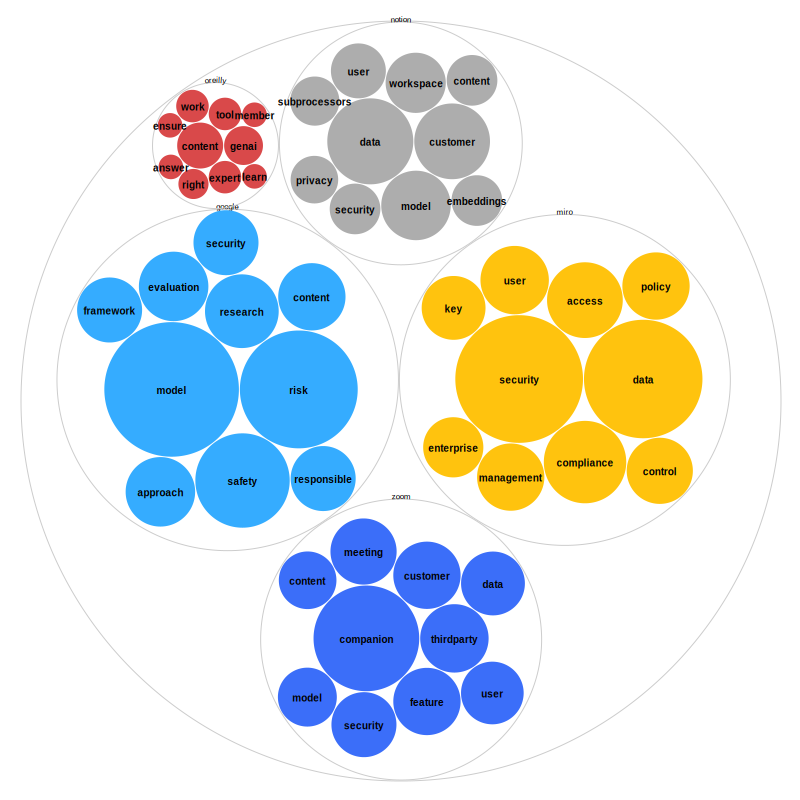

# Nudged by Design: White Paper Dataset

Borami Kang, Gaëtan Robillard, Yvette Shen, Fabienne Münch, _How AI Nudges Reshape Researcher Agency in Everyday Research Platforms_, HCII 2026.

## Dataset and Text Mining Method

This repertory includes 5 csv file, see [data](data). Each lists the top keyword found in white papers or online pages published by platforms on responsible AI.
Two different types of parameters are given: string (keyword), value (word frequency). The table below summarizes the analysis. The Colab notebook devising the text mining method is also shared [here](hcii-method.ipynb).

## Summary

| Source  | URL                                                                                                                                                                                        | Text length (characters) | Tokens after lemmatization | Total unique words | Top 5 words                                    |
| ------- | ------------------------------------------------------------------------------------------------------------------------------------------------------------------------------------------ | ------------------------ | -------------------------- | ------------------ | ---------------------------------------------- |
| Oreilly | [https://www.oreilly.com/about/oreilly-approach-to-generative-ai.html](https://www.oreilly.com/about/oreilly-approach-to-generative-ai.html)                                               | 3919                     | 337                        | 217                | content, genai, expert, tool, work             |
| Miro    | [https://help.miro.com/hc/en-us/articles/11869995720210-Miro-AI-whitepaper](https://help.miro.com/hc/en-us/articles/11869995720210-Miro-AI-whitepaper)                                     | 32269                    | 2878                       | 1053               | security, data, compliance, access, user       |
| Goolge  | [https://ai.google/principles/](https://ai.google/principles/)                                                                                                                             | 43226                    | 3787                       | 1200               | model, risk, safety, research, evaluation      |
| Notion  | [https://www.notion.com/help/notion-ai-security-practices](https://www.notion.com/help/notion-ai-security-practices)                                                                       | 14717                    | 1188                       | 470                | data, customer, model, workspace, user         |
| Zoom    | [https://www.zoom.com/en/products/ai-assistant/resources/privacy-security/#zoom-ai-companion](https://www.zoom.com/en/products/ai-assistant/resources/privacy-security/#zoom-ai-companion) | 18536                    | 1638                       | 568                | companion, thirdparty, feature, customer, meeting |
